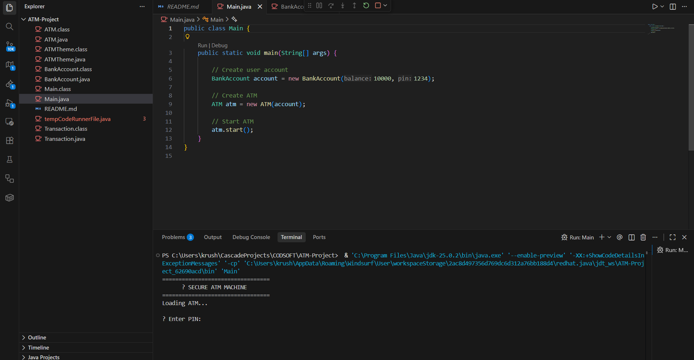
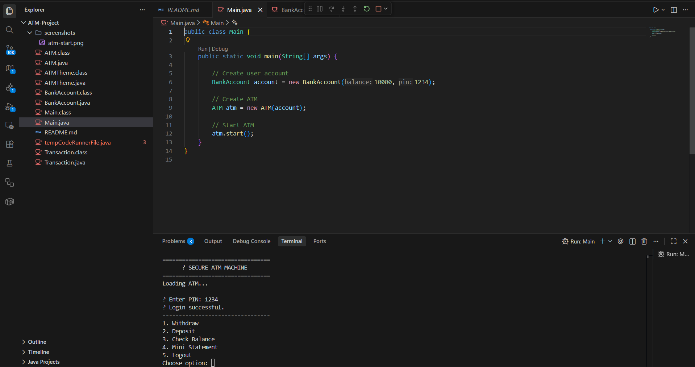

# 🏦 ATM Management System (Java)

A **console-based ATM Management System** developed using **Core Java** as part of my **Java Development Internship at CodSoft**.  
This project simulates real-world ATM operations and focuses on clean logic, validation, and user-friendly flow.

---

## 📌 Internship Details
- **Company:** CodSoft  
- **Internship Domain:** Java Development  
- **Intern Name:** Krushna Nawale  
- **Project Type:** Internship Task  
- **Mode:** Console-Based Application  

---

## 🎯 Project Objective
The main goal of this project is to understand how ATM systems work by implementing:
- Secure user authentication
- Transaction handling
- Balance management
- Input validation

This project strengthens **core Java concepts**, **control flow**, and **real-world problem-solving skills**.

---

## ✨ Features
- 🔐 **PIN-based Authentication**
- 💰 **Check Account Balance**
- ➕ **Deposit Money**
- ➖ **Withdraw Money**
- ❌ **Prevents Invalid Transactions**
- 📋 **Menu-driven Interface**
- 🔁 **Continuous Operations Until Exit**

---

## 🛠️ Technologies Used
- **Language:** Java  
- **Concepts:**  
  - OOP (Classes & Methods)  
  - Conditional Statements  
  - Loops  
  - Input Validation  
  - Exception Handling (basic)  

---
## 📸 Screenshots

### ATM Start


### ATM Menu


### Transaction Output

---

## ⚙️ How the System Works
1. User enters a **secure PIN**
2. System verifies authentication
3. Menu is displayed:
   - Check Balance
   - Deposit
   - Withdraw
   - Exit
4. User performs transactions
5. System updates and displays results instantly

---

## ▶️ How to Run the Project
1. Clone the repository:
   ```bash
   git clone https://github.com/Krushna4142/CODSOFT.git
