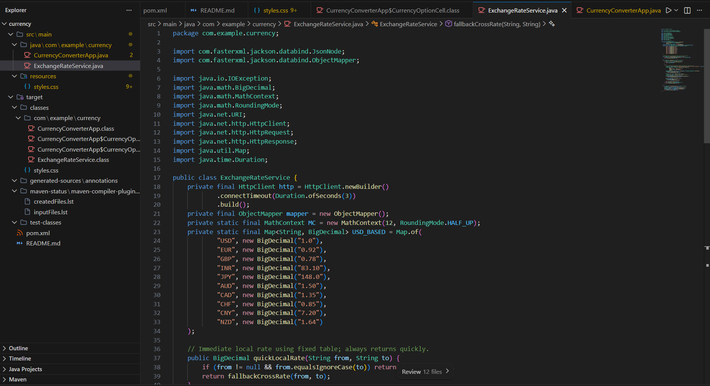
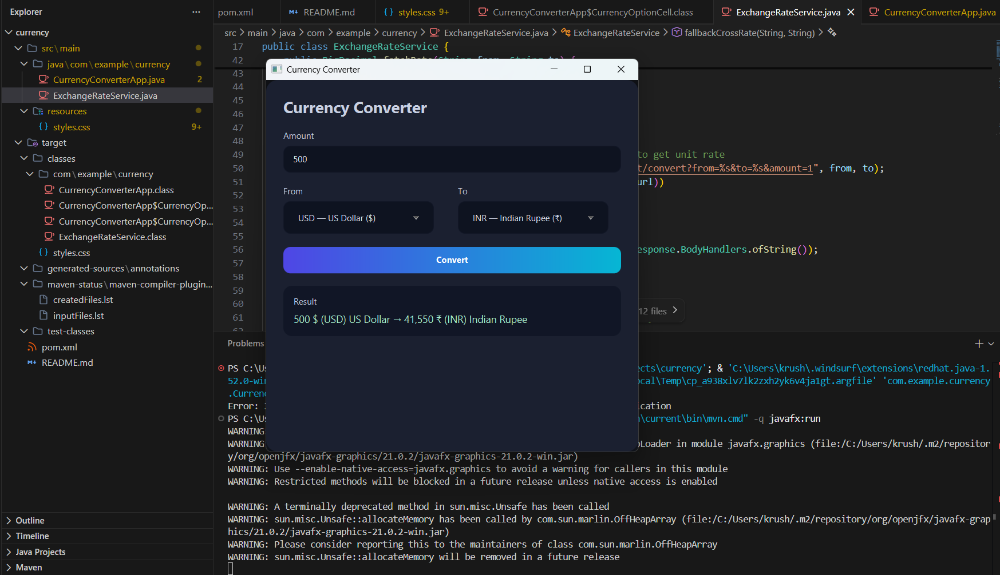

# 💱 Currency Converter – JavaFX

A clean, simple, and efficient **Currency Converter desktop application** built using **Java and JavaFX**.  
This project was developed as part of my **Internship Task** to demonstrate **API integration, core Java logic, and clean UI design**.

The focus of this project is **clarity, usability, and correctness**, keeping the application minimal while still following real-world development practices.

---

## 📌 Internship Context

This project was completed during my **internship** as an assigned task to:

- Work with **real-time data** using REST APIs  
- Apply **Java fundamentals** in a practical project  
- Build a **user-friendly interface** using JavaFX  
- Follow clean and readable code structure  

---

## 🧠 Project Overview

The Currency Converter allows users to convert an entered amount from one currency to another using **live exchange rates** fetched from a reliable public API.

Instead of adding unnecessary features, the application is designed to:
- Be **simple to use**
- Look **clean and professional**
- Be **easy to understand and explain** during interviews
-The project intentionally focuses on simplicity and clarity to demonstrate strong fundamentals rather than feature overload.


---

## ✨ Key Features

- 🌍 Select **source currency** and **target currency**
- ✍️ Input field for entering the amount
- 🔄 Fetches **real-time exchange rates**
- 🧮 Accurate currency conversion
- 📊 Displays the converted amount clearly
- 🎨 Minimal and clean JavaFX UI
- ⚠️ Basic input validation to avoid errors

---

## 🖥️ Screenshots

### Main Application Interface
> Clean layout with currency selection and conversion result



### Conversion Result Display
> Displays converted amount clearly after clicking the Convert button




---

## 🛠️ Tech Stack

- **Java**
- **JavaFX**
- **Exchange Rate API (public REST API)**


---

## ⚙️ Application Flow

1. User enters the amount to be converted  
2. Selects the **base currency**
3. Selects the **target currency**
4. Clicks the **Convert** button  
5. Application fetches the latest exchange rate  
6. Converted value is displayed to the user  

---

## 🚀 How to Run the Project

1. Clone the repository:
   ```bash
   git clone <repository-url>
