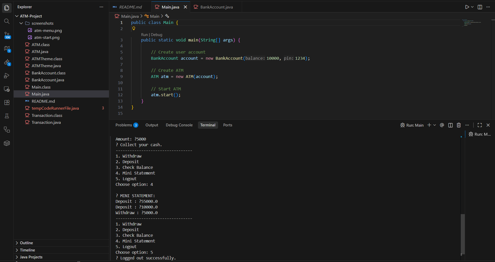
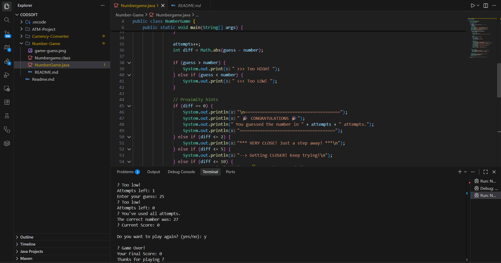

# 🚀 CODSOFT Internship Projects

This repository contains the projects completed by me during my **Java Development Internship at CodSoft**.  
Each project focuses on core Java concepts, problem-solving, and clean code practices.

---

## 🧑‍💻 Internship Details
- **Company:** CodSoft
- **Internship Domain:** Java Development
- **Intern Name:** Krushna Nawale
- **Mode:** Remote
- **Duration:** 1 Month

---

## 📂 Projects Overview

### 1️⃣ Currency Converter (Java)
A simple and clean currency converter application that converts one currency to another using real-time exchange logic.

**Features:**
- Base & target currency selection
- Amount input
- Convert button
- Result display
- Clean UI and simple logic

📁 Folder: `Currency-Converter`

📸 Screenshots:

---

### 2️⃣ ATM Project (Java)
A console-based ATM simulation system implementing real-world banking operations.

**Features:**
- PIN-based authentication
- Balance inquiry
- Deposit & withdrawal
- Input validation
- Menu-driven interface

📁 Folder: `ATM-Project`

📸 Screenshot:

---

### 3️⃣ Number Guessing Game (Java)
A fun console-based number guessing game that improves logical thinking.

**Features:**
- Random number generation
- Limited attempts
- Score tracking
- Replay option

📁 Folder: `Number-Game`

📸 Screenshot:

---

## 🛠️ Technologies Used
- Java
- JavaFX / Swing (for UI)
- Maven
- Git & GitHub

---

## 📌 Note
These projects were completed as part of the **CodSoft Internship Tasks** and are intended for learning and demonstration purposes.

---

⭐ If you like this repository, feel free to star it!
